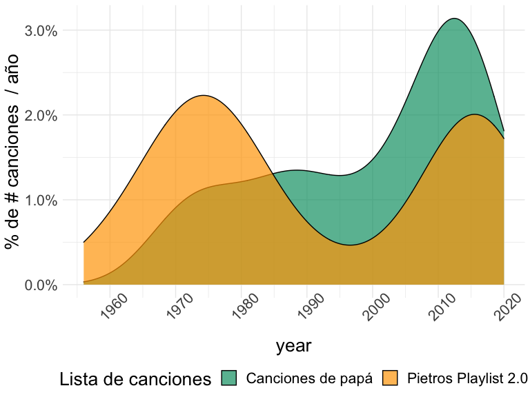
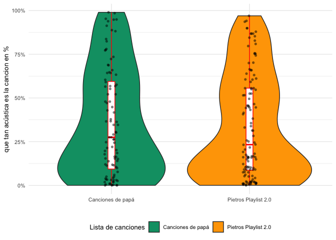
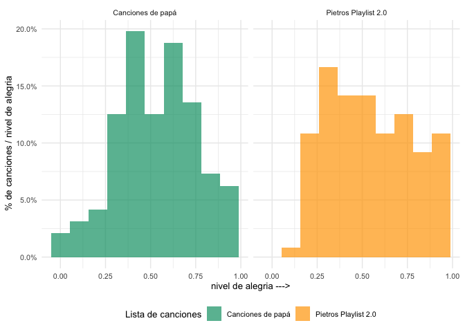
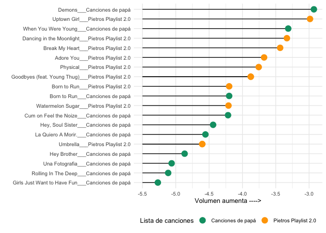
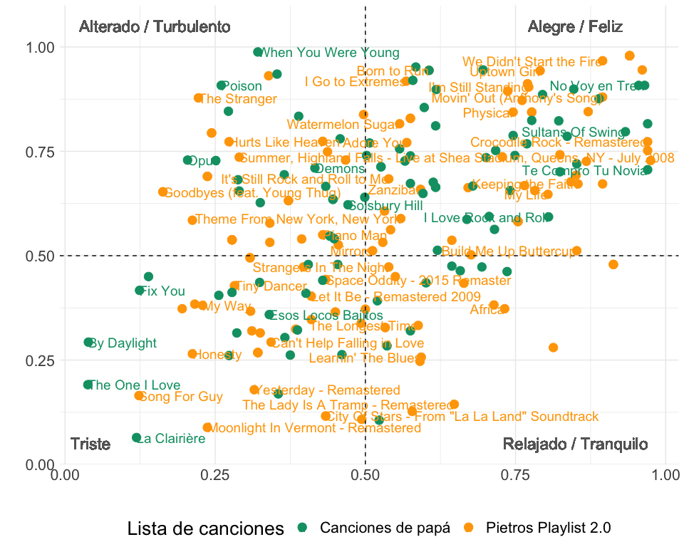

 

## Los participantes!!
 
 
 
  

## Tenemos dos listas de *Spotify* 

- Canciones de papá
- Pietros Playlist 2.0

 
 

## Vamos a responder algunas preguntas  

 
Spotify nos permite analizar a través de su  API  varias medidas asociadas a cada canción. Nuestro reto los vamos a realizar comparando las diferentes métricas y utilizando el paquete  spotifyr.
 

- Quien es el verdadero audiófilo retro ??
- nos gustan las versiones en acústico??
- quien monta mejor la fiesta??
- tenemos canciones alegres?? 
- quien molesta mas a los vecinos??
- vamos a comparar las listas en un gráfico que podemos resumir como energia contra humor (tomando la idea de [Rcharlie](http://rcharlie.net/sentify/))

 
 

## El premio del **ESPIRITU JOVEN** es para...

<!-- -->

### TENEMOS UN GANADOR!! uno de los dos tiene un   *ALMA MUY JOVEN !!!*   

 
 

## Versiones en acústico, a quién le gustan??

<!-- -->

### Esto es un empate técnico... quizas llamando al VAR?? 🧐 
 
 

##  Llego el momento de la rumba..!!
tenemos una medida en Spotify que, tomandonos una licencia, la traducimos al español como "bailabilidad"   

|lista                |titulo_de_la_cancion                          | bailabilidad|
|:--------------------|:---------------------------------------------|------------:|
|Canciones de papá    |Girls Like You (feat. Cardi B)                |        0.851|
|Canciones de papá    |El Venao                                      |        0.841|
|Canciones de papá    |Juana la Cubana                               |        0.833|
|Pietros Playlist 2.0 |Ob-La-Di, Ob-La-Da - Remastered 2009          |        0.818|
|Canciones de papá    |I Want You to Want Me                         |        0.806|
|Canciones de papá    |No Voy en Tren                                |        0.794|
|Pietros Playlist 2.0 |Keeping the Faith                             |        0.781|
|Canciones de papá    |Just Give Me a Reason (feat. Nate Ruess)      |        0.778|
|Canciones de papá    |Memories                                      |        0.764|
|Pietros Playlist 2.0 |Sunflower - Spider-Man: Into the Spider-Verse |        0.760|

### El  *TOP 10 de bailabilidad *  tiene un ganador!!!

 
 

## Vamos a buscar las canciones mas alegres  😄 

<!-- -->

### Las canciones con mayoria de mensajes alegres y positivos van para nuestro    participante mas joven !!!  

 
 

## Loudness, lo podriamos traducir como "ruidoso??... hay canciones que solo tienen sentido a todo volumen  🎉 🎚 🎙 
 

<!-- -->

### Esos puntitos verdes de arriba no nos engañan.. tenemos claro a quien buscan los vecinos cuando llaman!!!

 
 

## la comparacion final!!
 
Este gráfico, muestra la relacion de dos medidas que se pueden asociar de una manera muy suelta a sensaciones (descritas en las esquinas), aqui hacemos una comparacion de como se ven estas dos listas en este interesante espacio.
 
 

<!-- -->

## interesante gráfico 
La cobertura es similar en ambas listas, aunque en el cuadrante de "Relajado / Tranquilo" no aparece Pietro por ninguna parte... * Los vecinos nos dicen que ellos eso ya lo sabian!!  *

## El código lo puedes encontrar en mi cuenta de [github]("https://github.com/edperalt/batalla_de_playlists")