Hace mucho tiempo que he querido hacer un "heatmap" con mis datos deportivos, y este proyecto ha sido una de las motivaciones para aprender mas a programar. La siguiente imagen es un heatmap generado con Strava sale automático asi que mi único mérito es haber realizado las actividades con un gps.

<br/>

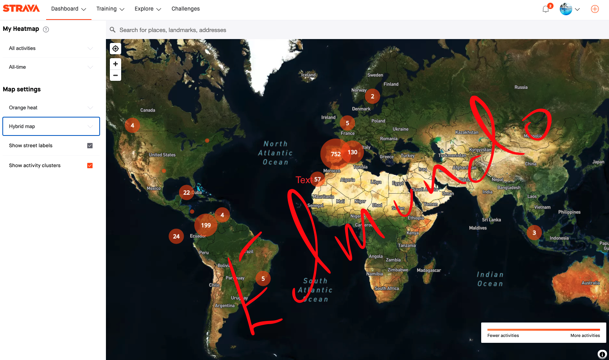


<br/><br/>

Hace unos de años encontré el repo de [Marcus Volz](https://github.com/marcusvolz/strava) donde tiene un app para leer archivos gpx y hacer una serie de gráficos muy interesantes para analizar los datos exportados, en el post Marcus explica como exportar los datos de [Strava](https://www.strava.com/login).

En mi caso yo tengo mis actividades sincronizadas en muchas bases de datos, y la manera mas sencilla que encontré para bajarlas en formato gpx fué con un script de [python](https://www.python.org/) que se llama [garmin-connect-export](https://github.com/pe-st/garmin-connect-export), este me ha exportado los gpx y algunos archivos adicionales como se ve en la siguiente imagen:

<br/>

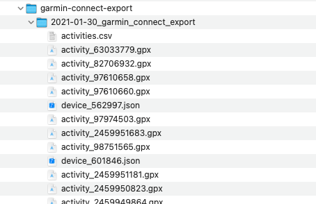

<br/>

## La carga de datos

### El archivo *activities.csv*

Voy a empezar con el archivo **activities.csv**, que tiene la lista de todas las actividades e incluye una larga lista de atributos para describir las actividades. el siguiente bloque muestra la carga y algunos cambios que preparan el código para gráficos mas adelante.

Hay que considerar que el script de [Marcus Volz](https://github.com/marcusvolz/strava) fué hecho ara strava y yo estoy utilizandolo para cargar archivos sacados de Garmin, y aunque el formato es el mismo hay sutilezas difeentes, como el tipo de actividad que [Strava](https://www.strava.com/login) lo exporta enel nombre del archivo y [Garmin](www.garmin.com) dentro del gpx.

Dicho esto vamos a comenzar el análisis.


<br/>

```r
## Cargamos el CSV resumen que exporta Garmin. 


all_data <- read_csv("../raw_data/garmin/csv/2021_jan_activities.csv", 
    col_types = cols(`Start Time` = col_character(),               # no logré cargar directamente eeste campo como tiempo, asi que lse extraigo las fechas mas abajo
        `End Time` = col_character(), Description = col_character(), 
        `Duration (h:m:s)` = col_time(format = "%H:%M:%S"), 
        `Elapsed Duration (h:m:s)` = col_time(format = "%H:%M:%S"), 
        `Moving Duration (h:m:s)` = col_time(format = "%H:%M:%S"), 
        `Average Speed (km/h or min/km)` = col_double(), 
        `Average Moving Speed (km/h or min/km)` = col_double(), 
        `Max. Speed (km/h or min/km)` = col_double())) 
  ## mutate para extraer  el mes y el año como numeros
  all_data<- all_data %>% 
   mutate(Año = as.factor(substr(all_data$`Start Time` , start = 1, stop = 4) ),
          month = as.numeric(substr(all_data$`Start Time`, start = 6, stop = 7)))

## transformamos los meses en texto y los pasamos a factores
all_data<- all_data %>% 
   mutate(  mes = as.factor(month.abb[all_data$month])) %>% 
   select(-month)  
   
# reorddenamos los niveles de los factores 

all_data$mes <- factor(all_data$mes, levels = c("Jan", "Feb", "Mar", "Apr", "May", "Jun", "Jul", "Aug", "Sep", "Oct", "Nov", "Dec") ) 
```

<br/><br/>

Una vez cargado el dataframe vamos a usar la libreria [DT](https://CRAN.R-project.org/package=DT) para mostrar los datos en forma de tabla, basicamente muestra todas las actividades que tengo en Garmin hasta finales de Enero del 2021.

<br/><br/>

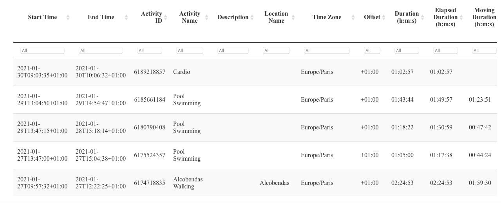<!-- -->

<br/>

Al revisar la tabla se ven muchos campos interesantes, comenzamos por hacer un gráfico de barras de las **Activity Parent** que representa la jerarquía mas alta en la clasificación de actividades.

<br/>

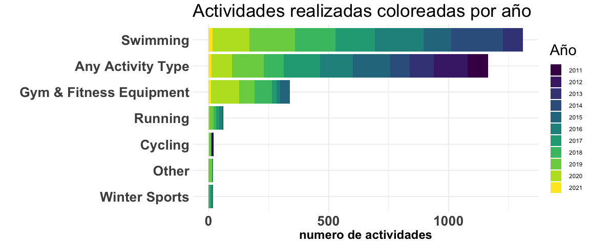<!-- -->

<br/>

Ninguna sorpresa hasta ahora, no hay secretos sobre mi debilidad por la piscina.

Garmin tiene otra variable que le da mas granularidad al tipo de deporte ("Activity Type), revisamos cuantas actividades hay y nos damos cuenta que hay algunas repeticiones de nombre tipo *Pool Swimming* y *Swimming* , o *Other* y *Uncategorized* jpor mencionar un par.


Aprovechando estos cambios que quiero hacer para racionalizar las categorías, aprovecho de colocarlas en Español.

<br/>

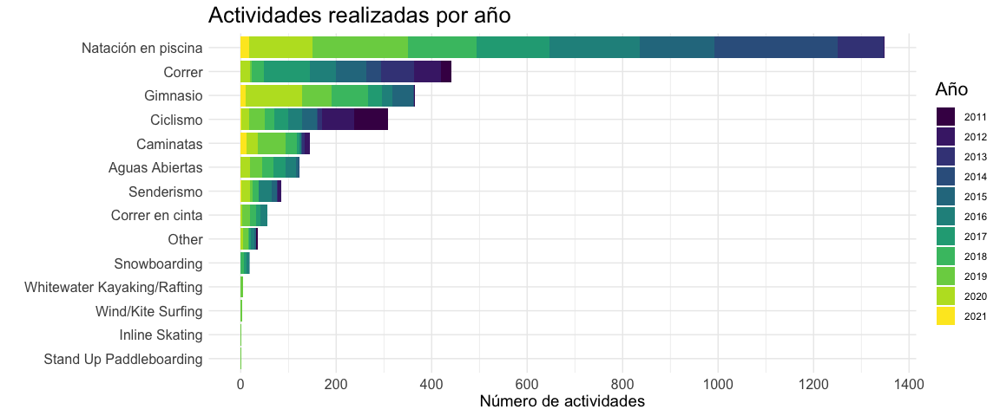<!-- -->

<br/>

Dejamos estratégicamente el **surf / kite surf** para el postureo y rmprzamos a analizar los resultados:

-   Garmin, y la industria de los relojes de deporte no tuvieron un reloj para nadar hasta el 2013 :-), yo comencé con un [garmin swim](https://buy.garmin.com/es-ES/ES/p/97287)\
-   Empecé a incorporar el gimnasio de manera consistente como complemento a mis entrenamientos de natación en el 2016
-   El snowboard es una pasión reciente

Ahora nos concentramos en la natación, y empezamos escribiendo una función para hacer un gráfico de barras por Año


Para trabajar enfocados en la natación hacemos los siguientes pasos:

-   filtramos para enfocarnos solo en Natación (Piscina y Aguas Abiertas)
-   eliminamos los años que no tienen datos de natación
-   calculamos los totales anuales de **Número de brazadas** (*Strokes*), **Distancia en Km** (*Distance(km)*) y **Duración de la actividad** (*Duration (h:m:s)*) .


Con los datos listos empezamos con los gráficos, aqui hay que notar 2 cosas:

-   voy a usar la librería [patchwork](https://patchwork.data-imaginist.com/) la acabo de descubrir y ya es una favorita, sirve para combinar gráficos, este no es el ejemplo mas sofisticado pero hace lo que quiero hacer.

-   noten que la columna de duración esta en segundos!!

<br/>


```r
brazadas <-
   bar_plot(resumen_anual, resumen_anual$Brazadas)+
      labs(y = "Número de brazadas",
        x = "", 
        title =  "Brazadas por año",
        fill = ""
        )
   
distancia <-
   bar_plot(resumen_anual, resumen_anual$`Distancia (km)`)+
   labs(y = "km nadados ",
        x = "", 
        title =  "Km nadados por año",
        fill = ""
        )
   
tiempo <-
   bar_plot(resumen_anual, resumen_anual$Duración /3600) +   # dividimos para tener HORAS
   labs(y = "horas nadadas ",
        x = "", 
        title =  "Horas nadadas por año",
        fill = ""
        )   

## aqui usamos patchwork

brazadas + distancia + tiempo
```

<br/><br/>

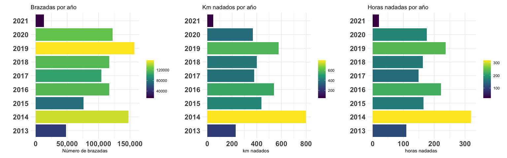<!-- -->

<br/><br/>

Es interesante analizar estos resultados porque aunque sufren de errores son tantos que permiten leer o recordar algunas situaciones:

-   en el 2014 nos preparamos para el mundial master, y se me dañó el reloj, ese año coloque manualmente muchos de los entrenamientos, de ahi el desface en brazadas.

-   En 2019 hicimos el circuito de aguas abiertas, por lo que empezamos a nadar mas.

-   2020 :-( aunque en España tener la licencia nacional de la federación nos permiti´o volver a entrenar un poco antes.

Que cosas agregan ruido a los gráficos??

-   En tiempo el hecho que algunas veces se me olvida apagar el reloj :-)

-   Hay un mínimo de veces que lo he dejado en casa,

-   Creo que recuerdo dos veces quedarme sin batería.

-   Es tecnología relativamente reciente, el primer reloj que tuve para nadar lo conseguí en el 2013

-   Las competiciones, la [FINA](http://www.fina.org/), que es el organismo que rige la mayoría de las competiciones en las que participo no permite los relojes (son medio locos), y aun cuando en piscina son relativamente pocas brazadas, en Aguas Abiertas es diferente cuando empezamos a a participar en algún circuito con varias carreras al año como mi 2019, La verdad que las razón principal de esta prohibición radica en minimizar accidentes ya que es fácil causar daño a otro nadador cuando llevas un reloj y chocas involuntariamente.

-   Número de brazadas se afecta porque en ocasiones dejo la opcion "drill mode"que no cuenta brazadas , solo tiempo y distancia. Especialmente los dias de entrenamiento de velocidad donde el reloj molesta un poco.

<br/>

## Vamos a los GPX y los mapas

Cambiamos objetivo y cargamos todos los gpx que tenemos para trabajar con mapas,

En este primer bloque usamos el script de [Marcus Volz](https://github.com/marcusvolz/strava) para leer los gpx, aqui los salvo como \*.RDS para leerlos mas rápidamente.


Empezamos por mi gráfico favorito se la libreria de [Marcus Volz](https://github.com/marcusvolz/strava), que hace un cuadro de todas las trazas o recorridos de las actividades disponibles, en este caso son desde 2011 hasta finales de Enero 2011 .En vez de usar la función de su paquete directamente, solo he tomado la idea.

En este caso organizo las trazas por fecha y he coloreado por año:


<br/>

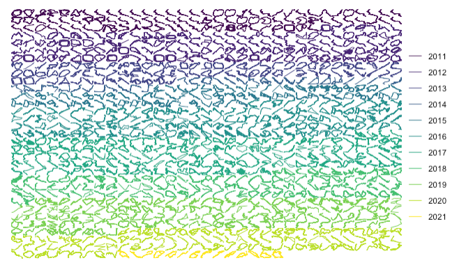<!-- -->

<br/>

El siguiente gráfico muestra las horas a las que he hecho ejercicio, se ve claramente la influencia de unos años en Bogotá , ya que la hora es la de España.

<br/>

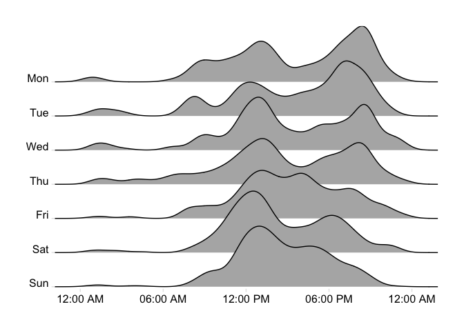<!-- -->

<br/>

Ahora con los mapas voy a usar la libreria [ggmap](https://journal.r-project.org/archive/2013-1/kahle-wickham.pdf) que permite utilizar varios servicios de mapas, aqui estoy utilizando [Stamen](http://maps.stamen.com/#watercolor).
<br/>


El siguiente es un heatmap de todas las actividades que tengo grabadas con el gps en España, los colores representan el año de la aventura.

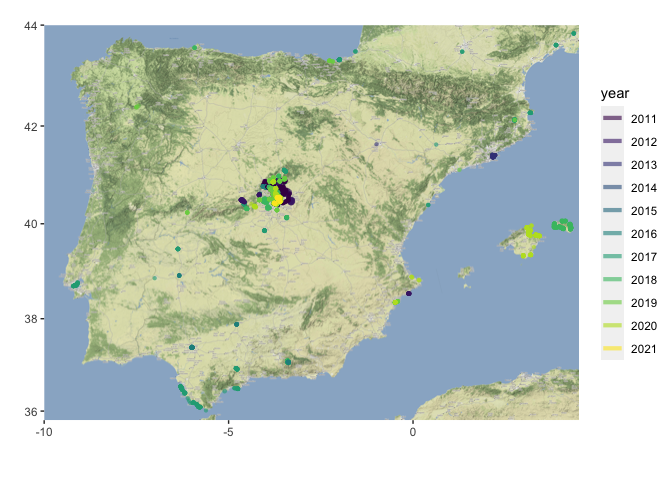<!-- -->

Ahora con un zoom en Madrid y separando los mapas por año.

<br/>


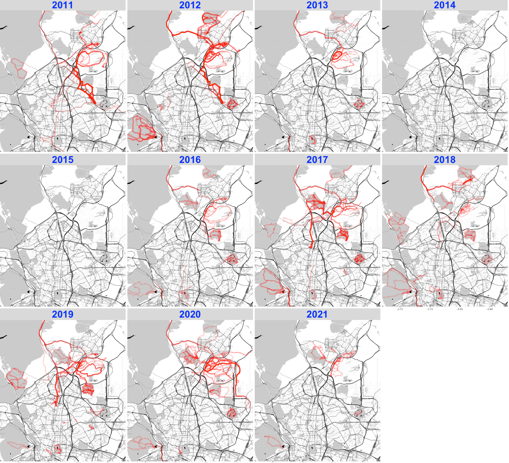<!-- -->

<br/>

Finalmente un mapa del mundo, pero hay que notar que [Stamen](http://maps.stamen.com/#watercolor) no cubre todo el mundo, para un mapa del mundo vamos a usar [sf](https://cran.r-project.org/package=sf) y [rnaturalearth](https://cran.r-project.org/web/packages/rnaturalearth/vignettes/rnaturalearth.html#:~:text=rnaturalearth%20is%20a%20data%20package,country%20and%20other%20administrative%20boundaries) que tiene los polígonos de los paises del mundo

<br/>


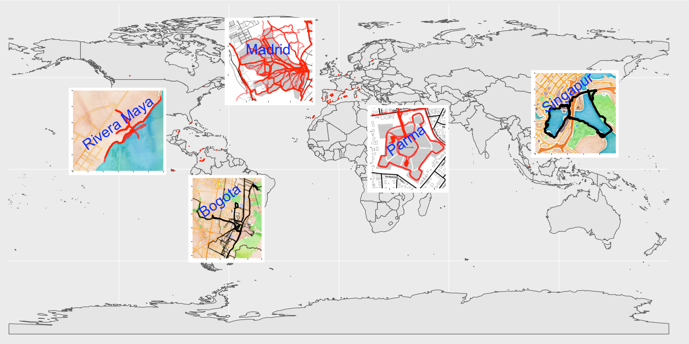<!-- -->
