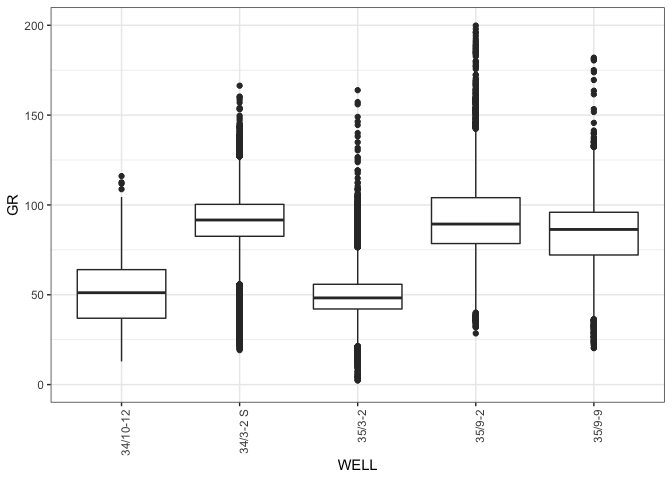
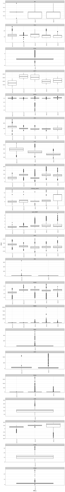
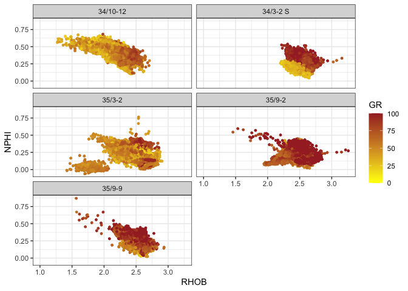

## LAS files

The LAS format is widely used in the Oil and Gas industry and is short from Log ASCII Standard, in this notebook we show a short workflow to load and qc multiple files. I´m using some files donated by [Geolink](https://www.geolink-s2.com/) to the geoscience community.

<br>

## The libraries

I will use to libraries:

-   the [tidyverse](https://www.tidyverse.org/) to perform data wrangling and plotting,

-   [petroreadr](https://github.com/ravenroadresources/petroreadr) from **Ravenroadresources** to load the **LAS** files.

-   [skimr](https://docs.ropensci.org/skimr/), to get an exccelent summary of the data. 

This script can be found on my [github repo](https://github.com/edperalt/geology_well_data_in_R)

<br>


```r
library(tidyverse)
library(petroreadr)
library(skimr)
```

<br>

## Loading the files

The library indicates in the documentation a few options, I normally choose:

-   load directly to a dataframe, which is my go to mode.\
-   set the verbose option to `TRUE`, this is particularly useful when working with large amount of wells/logs, to have the peace of mind that the machine is working and has not hanged.


<br>


```r
pathname <- "../../data/GEOLINK_Lithology and wells NORTH SEA/"

lasfiles <- list.files(pathname)
lasfiles <- lasfiles[grepl(".las", lasfiles)]
 
df<-read_las(file.path(pathname, lasfiles), verbose = TRUE)$data
```

```
##    + 34_10-12.las imported as <las> object
##    + 34_3-2 S.las imported as <las> object
##    + 35_3-2.las imported as <las> object
##    + 35_9-2.las imported as <las> object
##    + 35_9-9.las imported as <las> object
```

<br>

## the loaded data

We have obtained a dataframe with all logs, and a column with the well name that makes our life easier for plotting, filtering, etc.


<br>


```r
skim(df)
```


Table: Data summary

|                         |      |
|:------------------------|:-----|
|Name                     |df    |
|Number of rows           |73611 |
|Number of columns        |22    |
|_______________________  |      |
|Column type frequency:   |      |
|character                |1     |
|numeric                  |21    |
|________________________ |      |
|Group variables          |None  |


**Variable type: character**

|skim_variable | n_missing| complete_rate| min| max| empty| n_unique| whitespace|
|:-------------|---------:|-------------:|---:|---:|-----:|--------:|----------:|
|WELL          |         0|             1|   6|   8|     0|        5|          0|


**Variable type: numeric**

|skim_variable     | n_missing| complete_rate|    mean|     sd|      p0|     p25|     p50|     p75|     p100|hist  |
|:-----------------|---------:|-------------:|-------:|------:|-------:|-------:|-------:|-------:|--------:|:-----|
|DEPT              |         0|          1.00| 2410.31| 969.88|  215.22| 1711.01| 2425.34| 3082.65|  4407.62|▂▆▇▆▃ |
|Lithology_geolink |     21036|          0.71|    7.07|   3.81|    1.00|    5.00|    6.00|    7.00|    18.00|▂▇▁▃▁ |
|CALI              |      3029|          0.96|   11.92|   2.57|    2.02|    8.84|   12.50|   13.31|    26.73|▁▅▇▁▁ |
|DRHO              |      3418|          0.95|    0.02|   0.06|   -2.57|    0.00|    0.01|    0.04|     1.27|▁▁▁▇▁ |
|NPHI              |      9314|          0.87|    0.30|   0.11|   -0.06|    0.22|    0.30|    0.38|     0.87|▁▇▇▁▁ |
|RHOB              |      3487|          0.95|    2.38|   0.21|   -1.71|    2.26|    2.43|    2.53|     3.26|▁▁▁▃▇ |
|GR                |        16|          1.00|   70.61|  27.80| -197.12|   48.90|   70.44|   90.75|   866.92|▁▇▁▁▁ |
|DTC               |      9599|          0.87|  104.65|  25.45|  -16.58|   85.75|   98.96|  121.83|   265.00|▁▇▇▁▁ |
|RDEP              |       394|          0.99|   11.36| 147.15|    0.34|    1.34|    1.90|    3.51| 29270.71|▇▁▁▁▁ |
|SP                |     27351|          0.63|   83.83|  46.84| -279.13|   51.63|   88.53|  112.79|   178.31|▁▁▁▇▇ |
|RSHA              |     37489|          0.49|    7.85|  43.40|    0.13|    1.00|    2.01|    3.87|  1770.00|▇▁▁▁▁ |
|RMED              |       391|          0.99|    9.68|  76.45|    0.13|    1.37|    2.14|    4.06|  9700.00|▇▁▁▁▁ |
|BS                |     34035|          0.54|   10.94|   1.93|    8.50|    8.50|   12.25|   12.25|    17.50|▅▁▇▁▁ |
|ROP               |     46350|          0.37|   93.21|  92.07|    5.20|   47.13|   79.69|  125.87|  1290.77|▇▁▁▁▁ |
|THOR              |     70499|          0.04|   11.17|   4.59|    1.13|    7.42|   11.27|   14.53|    33.71|▅▇▅▁▁ |
|PEF               |     47126|          0.36|    5.51|   4.83|    1.35|    3.89|    4.64|    6.86|   667.36|▇▁▁▁▁ |
|URAN              |     70499|          0.04|    2.26|   1.44|   -0.54|    1.57|    2.26|    2.80|    27.93|▇▁▁▁▁ |
|DTS               |     53766|          0.27|  172.42|  34.20|   87.69|  141.12|  173.26|  201.25|   270.41|▂▇▇▆▁ |
|DCAL              |     61296|          0.17|    0.77|   1.39|   -4.81|    0.02|    0.30|    0.83|     7.88|▁▇▇▁▁ |
|SGR               |     67154|          0.09|  101.56|  32.54|   33.15|   81.72|  106.35|  116.22|   892.06|▇▁▁▁▁ |
|RMIC              |     71425|          0.03|   14.44|  38.00|    0.72|    4.74|    7.36|   12.76|   556.37|▇▁▁▁▁ |

<br>

## Quick view of a log

to check whether a well log is present in all wells, and compare some of their stats, the box plot is a powerful tool.

<br>


```r
box_1 <-
  df %>%
  ggplot(aes(WELL, GR)) +
  geom_boxplot() +
  theme_bw()+
  theme(axis.text.x=element_text(angle=90,hjust=1)
        )


box_1
```

```
## Warning: Removed 16 rows containing non-finite values (stat_boxplot).
```

<!-- -->

<br>

A quick view shows some negative values in well *34/10-12* and some potential outliers in well *35/9-2*, we can repeat the plot cropping on a range to have a better view.

<br>

<!-- -->

<br>

We can repeat the same for all logs at once to get a quick idea , however there are at least two points to consider when doing this:

-   the size of the plot will need to be increased to properly show all logs,

-   if you want to visualize a zoom of a particular log, you will need to apply a filter to the data before appliying the pivot.

-   similarly, when dealing with logs that behave logarithmicaly, I dont´t know how to set a logarithmic scale to a particular log using faceting, therefore I apply a log transform before the pivoting step.

<br>


```r
df %>% 
  mutate(log10_RDEP= log10(RDEP)) %>% 
  select(-RDEP) %>% 
  filter( GR >   0 ,
         GR  < 200 )  %>% 
  pivot_longer(!c("WELL"), names_to = "logs", values_to = "value") %>% 
  drop_na(value) %>%
  ggplot()+
  geom_boxplot(aes(WELL, value))+
  facet_wrap(~logs, scales = "free", ncol = 1) +
  theme_bw()+
  theme(axis.text.x=element_text(angle=90,hjust=1))
```

<!-- -->

<br>

## Density neutron plot

Just a quick plot set creating a color scale between 0 and 100, the values below 0 are filtered from the plot, but values above 100 are colored as 100.

<br>


```r
df %>% 
  filter(GR>0) %>% 
  ggplot(aes(RHOB,NPHI, color = GR))+
  geom_point( size = 1)+
  facet_wrap(~WELL, ncol = 2)+
  xlim(1,max(df$RHOB))+
  theme_bw()+
  scale_color_gradient(low = "yellow", high = "brown",limits = c(0,100), 
                       oob = scales::squish
                       )
```

<!-- -->


